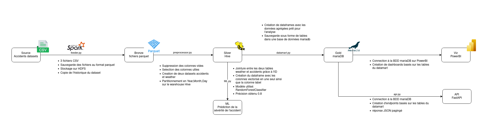

# traffic-accident-analytics

## Overview

`traffic-accident-analytics` is a comprehensive data processing and analytics pipeline built with Apache Spark, designed to handle traffic accident data ingestion, preprocessing, analytics, and machine learning. The project implements a complete data lakehouse architecture with REST API endpoints for data visualization and real-time insights.

## Architecture



The architecture comprises the following layers:

- **Bronze Layer**: Raw accident and weather data ingestion via HDFS.
- **Silver Layer**: Cleaned, partitioned data stored in Hive tables with optimized schemas.
- **Gold Layer**: Aggregated analytics and machine learning models stored in MySQL.
- **API Layer**: FastAPI endpoints for data access and visualization.

## Features

- **Data Ingestion**: Handles extraction of raw traffic accident and weather data.
- **Data Preprocessing**: Cleans, validates, and partitions data for optimal performance.
- **Analytics Engine**: Generates comprehensive insights on accident patterns and trends.
- **Machine Learning**: Implements predictive models for accident severity classification.
- **REST API**: Provides RESTful endpoints for data access and real-time querying.
- **Data Visualization**: Interactive API documentation with Swagger UI.

## Project Structure
```

traffic-accident-analytics/
├── spark-warehouse/           # Hive warehouse directory
├── metastore_db/             # Hive metastore database
├── feeder.py                 # Script for data ingestion to HDFS
├── preprocessor.py           # Script for data cleaning and partitioning
├── datamart.py               # Script for analytics and aggregations
├── ml.py                     # Script for machine learning tasks
├── api.py                    # FastAPI application for data access
├── database.py               # Database connection configuration
├── run_api.py                # API server launcher
├── spark-config.conf         # Spark configuration settings
├── architecture_finale.drawio.png # Architecture diagram
├── mysql-connector-j-9.3.0.jar # MySQL JDBC connector
├── .gitignore
└── README.md
```
## Getting Started

### Prerequisites

- Apache Spark 3.x in Standalone Mode
- Apache Hadoop/HDFS
- Python 3.11+
- MySQL/MariaDB
- Java 8+ (for JDBC connector)

### Installation

1. Clone the repository:
   ```bash
   git clone <repository-url>
   cd traffic-accident-analytics
   ```

2. Set up Python virtual environment:
   ```bash
   python -m venv venv
   source venv/bin/activate  # On Linux/Mac
   ```

3. Install required Python packages:
   ```bash
   pip install pyspark fastapi uvicorn mysql-connector-python sqlalchemy pandas python-dotenv
   ```

4. Configure environment variables:
   ```bash
   # Create .env file with your database credentials
   echo "DB_HOST=localhost" > .env
   echo "DB_PORT=3306" >> .env
   echo "DB_USER=your_username" >> .env
   echo "DB_PASSWORD=your_password" >> .env
   echo "DB_NAME=accidents" >> .env
   ```

5. Ensure Apache Spark, Hadoop, and MySQL are properly installed and configured.

### Usage

1. **Data Ingestion**: Load raw data into HDFS
   ```bash
   spark-submit --properties-file spark-config.conf feeder.py
   ```

2. **Data Preprocessing**: Clean and partition data into Hive tables
   ```bash
   spark-submit --properties-file spark-config.conf preprocessor.py
   ```

3. **Generate Analytics**: Create aggregated insights and store in MySQL
   ```bash
   spark-submit --properties-file spark-config.conf datamart.py
   ```

4. **Train ML Models**: Apply machine learning for predictive analytics
   ```bash
   spark-submit --properties-file spark-config.conf ml.py
   ```

5. **Start API Server**: Launch FastAPI for data access
   ```bash
   uvicorn api:app --reload --host 0.0.0.0 --port 8000
   ```

6. **Access API Documentation**: Visit `http://localhost:8000/docs` for interactive API documentation

## API Endpoints

The REST API provides the following endpoints:

- `GET /tables` - List all available data tables
- `GET /tables/{table_name}` - Get table schema information
- `GET /tables/{table_name}/data` - Retrieve table data with pagination
- `GET /tables/{table_name}/search` - Search within table data

## Data Analytics

The platform generates multiple analytical insights:

- **Temporal Analysis**: Accident patterns by day, hour, and season
- **Geographic Hotspots**: State and city-level accident concentration
- **Weather Impact**: Correlation between weather conditions and accidents
- **Severity Prediction**: Machine learning models for accident severity
- **Infrastructure Analysis**: Road feature impact on accident frequency

## Machine Learning

Implements RandomForestClassifier for:
- Accident severity prediction
- Feature importance analysis
- Model performance evaluation
- Real-time prediction capabilities

